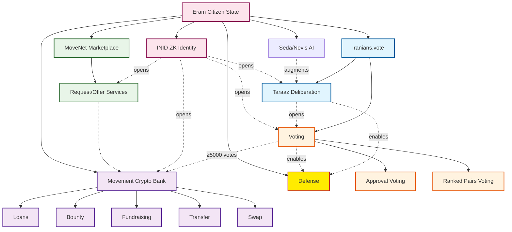
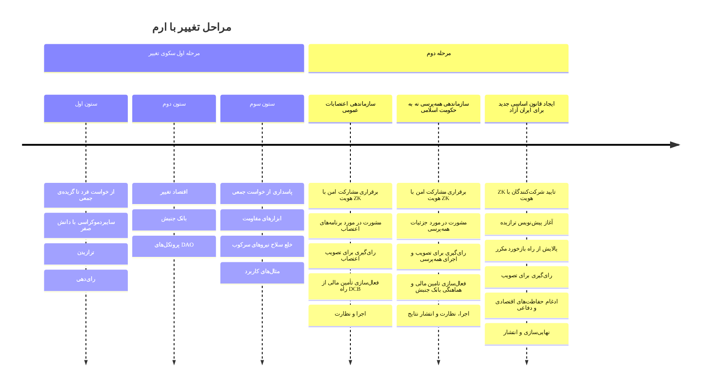

ایران با چالش‌های پیچیده‌ای دست و پنجه نرم می‌کند و امروز در میانه‌ی جنگ است. حکومت اسلامی، با جنایت سازمان‌یافته سَدی بر آزادی بیان و تجمع است، و با ایجاد و تعمیق فضای متخاصم سیاسی، اجتماعی و اقتصادی، بسیاری از ایرانیان را به مهاجرت و پراکندگی در سراسر جهان، یا گوشه‌نشینی و ناامیدی واداشته است.  
شکاف‌های عمیق ناشی از تبعیض، ناهم‌ترازی در گفتمان، و تاخیر فرهنگی در برابر پیش‌رفت‌های دستگاه سرکوب، از مردمان ایران هزارجزیره‌ای بی‌دفاع مقابل حکومت اسلامی، و بی‌صدایانی نظاره‌گرِ واکنش‌های جامعه‌ی جهانی در رویایی با این دستگاه تبهکار ساخته است. ایرانیان در تامین شکل زیست جمعی خود بسیار کم‌توان‌اند.  
هرگونه چاره‌جویی برای مسئله‌ی ایران باید کل‌نگر و متضمن امنیت باشد،‌ سازوکار شفاف اقتصادی-سیاسی داشته باشد، و مبتنی بر خواست مردم و پاسدار حقوق و آزادی‌های بنیادین بشر باشد.  
در ادامه مجموعه‌ای از روش‌ها و ابزارهایی بنیادین، بهینه،‌ قابل اندازه‌گیری و راستی‌آزمایی، با پیوندهای انکارنشدنی و امکان توسعه سریع و سراسری، برای خلع سلاح حکومت اسلامی و بازسازی ایران، ارائه شده است.  
بنیاد تئوری سیاسی و روش‌های تغییر پیشنهادی این سند محاسبه‌ی عادلانه و دقیق گزیده‌ی جمعی برپایه‌ی خواست فردی است. در این تئوری وزین‌ترین ارزش‌ها امکان و تضمین مشارکت است.  

 

  طرحی برای تغییر 

دولت شهروندی اِرم، برای تغییر، بر محور گزیده‌ی جمعی و بر بن خواست و عاملیت فردی‌ست.  
باور و پیش‌فرض‌های این طرح به قرار زیرند:   
ـ حاکمیت از آن حکومت‌شونده است    
ـ عاملیت سیاسی با مشارکت سراسری گره خورده   
ـ مردم ایران توانایی تکمیل پازل تغییر را دارند  
ـ چنان‌که مردم ایران در شرایط اجبار کنونی بمانند، و پیشنهادهای تغییری همچون ارم را به‌کار نبرند، ممکن است ناچار به پذیرش هر تصمیم ناخواسته‌ی دیگری بشوند.  
ـ اگر می‌خواهیم در راه تغییر مختار باشیم، طرحی این‌چنین باید امروز و در کوتاه‌ترین زمان به آگاهی و کابرد از سوی همگان برسد.  
ـ مردم به اجرای طرحی تعهد همراهی می‌دهند که خود در ساخت آن شریک باشند.  
ـ بنای دموکراسی گفتگو است، و تمام فضاهای گفتگوی دیگر متاثر از آلودگی‌های سازمان‌یافته‌اند، فضای مورد نیاز لزومن از آسیب‌های سازمان‌یافته مصون است.  
ـ هرگونه ایده‌ی تغییر باید دست‌کم شامل ۳ ستون، با طراحی کارآمد و متناسب با فضای متخاصم باشد.  

## سه ستون تعادل  
**مشارکت**: ترازیدن و رای‌دهی و امکانات پی‌گیری تبعات آن

**ابزارهای مالی**: شفافیت انباشت و جابجایی هدف‌مند ارزش، بازار خدمات و درخواست با دسترسی جهانی

**برنامه‌ی امنیتی**: توسعه‌ی ابزارهای دفاعی، توسعه و به‌کار بستن فوری تعهدات امنیتی 

## ستون یکم:‌ مشارکت، از خواست فرد تا گزیده‌ی جمعی
### سایبردموکراسی با دانش صفر
دیجیتال دموکراسی، ای-دموکراسی، یا سایبردموکراسی بهینه‌سازی فرایندهای تصمیم‌گیری دموکراتیک با فناوری دیجیتال را پی می‌گیرد.  
دانش صفر در این زمینه‌ی کاری به معنای اثبات بی‌همتایی و داشتن شهروندی ایران بدون افشای هرگونه جزییات دیگر در مورد فرد است. هویت شهروندی دیجیتالی افراد شناسه‌ای یکتا برپایه‌ی رمزنگاری* پیش‌رفته است که با امنیت بالا در کارت‌های هوشمند ملی و پاسپورت‌های بایومتریک، هویت بیولوژیک فرد را به هویت شهروندی دیجیتال او گره می‌زند. با روش دانایی صفر این کارت‌ها امکان مشارکت ناشناس افراد را فراهم می‌آورند.  
پلتفرم‌ها و ابزارهای توسعه‌یافته برای این منظور:    
ـ National ID Card کارت هوشمند ملی [INID SDK](https://github.com/Iranians-Vote-Digital-Democracy/INIDOSDK)  
ـ Biometric Passports. [ZK Passport](https://github.com/rarimo/#zk-passport)

### ترازیدن
دموکراسی ترازشی یک مدل حکومتی است که بر بحث‌های منطقی، مشارکت فراگیر و تصمیم‌گیری مبتنی بر شواهد میان شهروندان تاکید دارد، به جای اینکه صرفن به رای‌گیری یا مناظره‌های خصمانه تکیه کند. هدف این رویکرد پرورش درک متقابل، کاهش قطبی‌سازی و تولید نتایج مشروع‌تر از راه فراهم‌آوری منابع دانشی، تشویق افراد به ارزیابی استدلال‌ها، بررسی دیدگاه‌های متنوع و پالایش دیدگاه‌شان از راه گفتگوی گروهی است.  
این روش در برابر دموکراسی برافزونشی aggregative، که صرفن ترجیحات را جمع‌آوری می‌کند، قرار می‌گیرد. کلید این روش شکل‌دهی به گروه‌های نمایان‌گر تصادفی گزیده‌شده برای بحث در مورد مسائل جامعه و شبیه‌سازی یک جامعه‌ی آگاه است.  

تالارهایی مدیریت‌شده برای بحث‌های متمرکز، با الزام استدلال‌های منبع‌دار، گفتگوهای چندشاخه برای پیگیری تکامل ایده‌ها، مشارکت ناهم‌زمان برای دسترسی جهانی، رای‌گیری مبتنی بر کیفیت (اولویت‌دهی به شایستگی بر محبوبیت)، نظرسنجی‌های یکپارچه برای ارزیابی تغییرات نظر، و همراهی کارآمد هوش مصنوعی است. هوش مصنوعی متن باز با امکان راستی‌آزمایی در نوشتن، خواندن، توسعه و خلاصه‌سازی، یافتن موارد مشابه، ایجاد پیوند معنایی بین مطالب، و حذف مطالب تکراری همیاری می‌کند.  
https://github.com/nextodon/nextodon   
https://github.com/LemmyNet/lemmy

### رای‌دهی
در پیوندی میان computational social choice،‌ بلاک‌چین و دانش صفر، ابزارهای رای‌دهی تاییدی و رده‌بندی برای انواع تصمیم‌گیری، مبتنی بر استانداردهای سیستم‌های رای‌گیری، و برای تضمین شفافیت، امنیت و دقت پیاده‌سازی شده‌اند.  
https://github.com/Iranians-Vote-Digital-Democracy  
https://github.com/tcfev/iranians-vote  
https://github.com/pivot-libre/tideman  

## ستون دوم:‌ اقتصاد و ابزارهای مالی
اقتصاد قابل اعتماد لازمه‌ی چشم‌پوشی‌ناپذیر تغییر، پیش‌رانه‌ی بازسازی، و رسانه‌ی ارزش است. هرگونه برنامه‌ی تغییر در مسئله‌ی ایران نیاز به تولید و جابجایی ارزش، انباشت بابرنامه و اندازه‌گیری‌شده سرمایه، و بهره‌مندی از شاخصه‌های کلیدی شفافیت‌ و امنیت، حفظ محرمانگی و حریم خصوصی، و غیرمتمرکزیت دارد.  
بانک جنبش، برای هر موضوع فراگیر، برای مثال اعتصابات سراسری، که مورد گزینش مردم قرارگیرد (۵۰۰۰ نفر به آن رای بدهند، یا گروه نمایانگر آن‌را برگزیند) پروتکل‌های سازما‌ن‌های خودمختار غیرمتمرکز/DAO برپایه‌ی رمزارز را به‌راه می‌اندازد. بازه‌ی گسترده‌ای از ابزارهای مالی از جمله امانت، ضمانت،‌ دادوستد شفاف و ناشناس، پاداش، وام و اعانه از جمله امکانات در خدمت تغییر خواهند بود.  
ـ https://github.com/dexe-network/DeXe-Protocol  
ـ [Cyberdemocracy DAO Platform - Analysis & Plan (درخواست دسترسی بفرستید) 
](https://docs.google.com/document/d/1amO5ByDhkCTP1Dmq3dgT6bFQ73s8ul4HNpH6mkXOlJw/edit?pli=1&tab=t.0#heading=h.qz42grosnfb)
## ستون سوم:‌ پاسداری از گزیده‌ی جمعی
پایین آوردن تلفات انسانی و خسارات مهم‌ترین نگرانی تغییر است. ساخت و توسعه‌ی منابع و ابزارهای مقاومتِ فرمان‌بردار از گزیده‌ی جمعی، برای مراقبت، خلع سلاح یا از میان‌بردن نیروهای سرکوب حکومت اسلامی و پشتیبانانش ستون لازم برای تعادل هر برنامه‌ی جامع تغییر است. نمونه‌های موجود:

ـ [ProCivilian's Tyseek Framework درخواست دسترسی بفرستید](https://docs.google.com/presentation/d/1TjmIle1H5evBLtjF5ouHNEeFFhkqDCI2HCGWMkjHpNg/edit?slide=id.g362d5c5a99e_2_6#slide=id.g362d5c5a99e_2_6)

# مثال‌های کاربردی
در ادامه فراروندهایی برای تغییر، که برای موفقیت نیاز به کنش سراسری و ساختارمند دارند، و در چارچوب طرح تغییر پیشنهادی می‌گنجد را آورده‌ایم:

## سازماندهی اعتصابات سراسری و تامین مالی آن
اعتصابات مجموعه‌ی شیوه‌ها، و اقداماتی جمعی‌اند که نیاز به ساخت توافق، تامین مالی، و فعال‌سازی مکانیزم‌های دفاعی دارند.

### گام ۱: برقراری مشارکت امن با هویت ZK
۱. سیستم هویت ZK INID (از SDK کارت ملی یا پاسپورت‌های بایومتریک) را برای تایید شرکت‌کنندگان به عنوان شهروندان یکتای ایرانی بدون افشای جزئیات شخصی به‌کار ببرید. این امر مشارکت ناشناس را تضمین می‌کند.  
۲. شرکت‌کنندگان در پلتفرم دولت شهروندی اِرم ثبت‌نام و به ابزارهای مشورتی و رای‌گیری دسترسی پیدا می‌کنند. ابزارهایی مانند Iranians.Vote INID اثبات‌های دانش صفر برای هویت ارائه می‌دهند، جایی که داده‌ها برای حفظ حریم خصوصی هش می‌شوند.

### گام ۲: مشورت در مورد برنامه‌های اعتصاب
۱. بحث‌ها را در انجمن ترازش Taraaz (تقویت‌شده از سوی AI Seda/Nevis برای خلاصه‌سازی، لینک‌دهی ایده‌ها، و حذف تکرارها) آغاز می‌شود.  
۲. پلتفرم‌ها: از انجمن‌های فدرال مانند Lemmy (برای بحث‌های رشته‌ای، moderation، و رای‌گیری بر ایده‌ها) یا Nextodon (برای نمونه‌های خودمیزبانی‌شده، سازگار با Fediverse که از مشارکت جهانی ناهمزمان پشتیبانی می‌کند) بهره ببرید.  
۳. تمرکز ترازش بر عناصر کلیدی: زمان‌بندی اعتصاب، بخش‌ها (مانند نفت، آموزش)، خواسته‌ها (مانند تغییر رژیم، حقوق)، و پروتکل‌های ایمنی. مدیران انتخابی و AI در ارزیابی استدلال‌ها، منبع‌یابی شواهد، و پرورش اجماع برای کاهش قطبی‌سازی یاری می‌رسانند.
  
### گام ۳: رای‌گیری برای تصویب اعتصاب
۱. گزینه‌ها و توضیحات کافی به پلتفرم Iranians.vote برای رای‌گیری رسمی برده می‌شوند.  
۲ روش‌ها:  
 ـ رای‌گیری تاییدی (برای اجماع گسترده بر عناصر اعتصاب) و/یا  
  ـ رای‌گیری جفت‌های رتبه‌بندی‌شده (پیاده‌سازی‌شده از طریق الگوریتم Tideman از مخزن pivot-libre/tideman، برای رتبه‌بندی گزینه‌ها مانند مدت اعتصاب یا اهداف).   
۳. آستانه: نیاز به ≥۵۰۰۰ رای برای فعال‌سازی ماشه‌ی DAO. هر رای می‌تواند tokenised شود (مانند ۱ Ïrani ≈۱۰¢) برای تعهد وزنی، تضمین قابلیت تایید از راه بلاکچین.

### گام ۴: فعال‌سازی تامین مالی از راه DCB
۱. پس از تصویب، DAO را با بهره‌گیری از قراردادهای هوشمند راه‌اندازی کنید.  
۲. مکانیسم‌های تامین مالی:  
ـ جمع‌آوری: جمع‌آوری وجوه از دیاسپورای ایرانی جهانی و از راه فرستادن کریپتو یا سوآپ‌ها.
 DCB کمک‌های ناشناس را مدیریت می‌کند.  
ـ جایزه‌ها: ارائه پاداش برای سازمان‌دهندگان کلیدی (مانند هماهنگ‌کنندگان لجستیک) یا فراریان ارایه‌دهنده اطلاعات.  
ـ وام‌ها و کمک‌های بلاعوض: ارایه وام‌های بدون بهره به اعتصاب‌کنندگان برای تامین موارد اولیه (مانند غذا، جابجایی) از راه پروتکل‌های وام DCB.  
۳. ادغام بازار: استفاده از بازار MoveNet برای درخواست/ارایه خدمات مانند ابزارهای ارتباطی امن یا خانه‌های امن، پرداخت‌شده از راه DCB.  
۴. شفافیت: تمام تراکنش‌ها برپایه‌ی بلاکچین، قابل حسابرسی و غیرحضانتی هستند تا از مصادره رژیم جلوگیری شود.

### گام ۵: اجرا و نظارت
۱. هماهنگی از راه کانال‌های رمزنگاری‌شده مرتبط با پلتفرم.  
۲. اندازه‌گیری موفقیت: پیگیری مشارکت از راه Check-in/oracle تاییدشده؛ بهره‌گیری از AI برای تحلیل بازخورد real-time.  
۳. خطرات: تاکید بر تاکتیک‌های غیرخشونت‌آمیز؛ راه‌اندازی ماژول دفاع در صورت تشدید تهدیدها (برای دیدن راهنمای ۴ درخواست دسترسی بفرستید).  

| کامپوننت | نقش در سازماندهی اعتصاب | ابزارهای سکوی تغییر |
|---|---|---|
| **هویت ZK** | تایید ناشناس | INID، پاسپورت ZK |
| **مشورت** | توسعه برنامه | Taraaz با AI، مخازن Lemmy/Nextodon |
| **رای‌گیری** | تصویب اجماع | Iranians.vote، جفت‌های رتبه‌بندی‌شده Tideman |
| **بانک غیرمتمرکز جنبش** | تامین مالی اعتصابات | DAO DeXe, donation, fundraising, جایزه‌ها |
| **بازار** | هماهنگی خدمات | درخواست/ارائه خدمات |

این رویکرد تضمین می‌کند که اعتصابات از پایین به بالا، داری تامین مالی امن، و مقیاس‌پذیر هستند، و بر اراده جمعی و قابلیت اعتماد اقتصادی استوارند.

## سازماندهی همه‌پرسی نه به حکومت اسلامی

پلتفرم‌هایی مانند Eram Citizen State، Taraaz Deliberation، Iranians.vote و بانک کریپتو جنبش (DCB) می‌توانند کمک کنند تا فرآیند امن، ناشناس، فراگیر و مبتنی بر اجماع باشد. این سیستم ریسک‌های سرکوب رژیم را با استفاده از هویت دانش صفر (ZK) کاهش می‌دهد، مشورت را برای ساخت اجماع آسان می‌سازد، رای‌گیری را برای حقانیت و مشروعیت تضمین می‌نماید، و تامین مالی را برای اجرا و انتشار نتایج فراهم می‌کند. همه‌پرسی به عنوان یک «اقدام جمعی» تلقی می‌شود که بر اراده‌ی فردی برای تغییر رژیم تمرکز دارد، و می‌تواند به عنوان ابزاری برای بسیج جهانی و فشار بین‌المللی کار کند.

### گام ۱: برقراری مشارکت امن با هویت ZK

از سیستم هویت ZK-INID (از SDK کارت ملی یا پاسپورت‌های بیومتریک) برای تایید شرکت‌کنندگان به عنوان شهروندان ایرانی به‌همتا بدون افشای جزئیات شخصی استفاده کنید. این امر ناشناس بودن را تضمین کرده و از نفوذ رژیم یا دستکاری جلوگیری می‌کند. رژیم نخواهد توانست در زمان مناسب با این همه‌پرسی مقابله کند، و پرسش‌ها تمامن مثبت و در چارچوب حقوق و آزادی‌های بنیادین بشرند. مثال:‌ من به حکومت اسلامی نه می‌گویم  

شرکت‌کنندگان در پلتفرم دولت شهروندی Eram ثبت‌نام می‌کنند و به ابزارهای مشورتی و رای‌گیری دسترسی پیدا می‌کنند. ابزارهایی مانند Iranians.Vote اثبات‌های ZK برای هویت ارائه می‌دهند، جایی که داده‌ها برای حفظ حریم خصوصی هش می‌شوند.

### گام ۲: مشورت در مورد جزئیات همه‌پرسی

بحث‌ها را در انجمن مشورتی Taraaz (تقویت‌شده از سوی AI Seda/Nevis برای خلاصه‌سازی، لینک‌دهی ایده‌ها، و حذف تکرارها) آغاز کنید.  

پلتفرم‌ها: از انجمن‌های فدرال مانند Lemmy (برای بحث‌های رشته‌ای، moderation، و رای‌گیری بر ایده‌ها) یا Nextodon (برای نمونه‌های خودمیزبانی‌شده، سازگار با Fediverse که از مشارکت جهانی ناهمزمان پشتیبانی می‌کند) استفاده کنید.  

تمرکز مشورت‌ها بر عناصر کلیدی: همه‌پرسی عدم اعتماد مانند «من به حکومت اسلامی نه می‌گویم»، روش‌های رای‌گیری، دامنه‌ی سراسری درون ایران و دیاسپورا، و پروتکل‌های ایمنی. مدیران، متخصصین، و AI در ارزیابی استدلال‌ها، منبع‌یابی شواهد (مانند گزارش‌های حقوق بشر)، و پرورش اجماع برای کاهش قطبی‌سازی کمک می‌کنند.

### گام ۳: رای‌گیری برای تصویب و اجرای همه‌پرسی

۱. به پلتفرم Iranians.vote برای رای‌گیری رسمی بروید.

روش‌ها:  

۱. رای‌گیری تاییدی (برای اجماع گسترده بر سؤال و جزئیات) یا  
۲. Ranked Pairs Voting (پیاده‌سازی‌شده از راه الگوریتم Tideman از مخزن pivot-libre/tideman، برای رتبه‌بندی گزینه‌های جایگزین مانند سؤالات مختلف).

آستانه: نیاز به ≥۵۰۰۰ رای برای راه‌اندازی همه‌پرسی و خدمات مالی، هر رای می‌تواند توکنیزه شود (مانند ۱ Ïrani ≈۱۰¢ برابر با ۱۰ هزار تومن) برای تعهد وزنی، تضمین قابلیت تایید از راه بلاکچین. پس از تصویب، رای‌گیری اصلی همه‌پرسی آغاز می‌شود.

### گام ۴: فعال‌سازی تامین مالی و هماهنگی بانک جنبش

پس از تصویب، DAO را با استفاده از قراردادهای هوشمند DeXe Protocol برای بانک غیرمتمرکز راه‌اندازی کنید.

#### مکانیسم‌های تامین مالی:

ـ جمع‌آوری وجوه: crowdfund از دیاسپورای ایرانی جهانی با استفاده از انتقال‌های کریپتو یا سوآپ‌ها برای پوشش هزینه‌های تبلیغاتی، توسعه‌ی ابزارهای رای‌گیری دیجیتال، یا کمپین‌های آگاهی‌بخشی و … DCB کمک‌های ناشناس را مدیریت می‌کند.  
ـ جایزه‌ها: ارائه پاداش برای سازمان‌دهندگان (مانند مدیران کمپین) یا کارشناسان حقوقی برای تدوین پرسش‌ها، حضور رسانه‌ای …  
ـ وام‌ها و کمک‌ها: ارائه‌ی پشتیبانی مالی به شرکت‌کنندگان در معرض خطر  
ـ ادغام بازار: استفاده از MoveNet Marketplace برای درخواست/ارائه خدمات مانند ابزارهای تبلیغاتی امن، ترجمه اسناد، یا پوشش رسانه‌ای، پرداخت‌شده از راه DCB.  
ـ شفافیت: تمام تراکنش‌ها بر بستر بلاکچین، قابل حسابرسی، و غیرحضانتی هستند تا از مصادره رژیم جلوگیری شود. (compliance integration & SEC role to be discussed)

### گام ۵: اجرا، نظارت و انتشار نتایج

همه‌پرسی را از راه کانال‌های رمزنگاری‌شده، رسانه‌های همگانی و … معرفی و روی پلتفرم Iranians.vote اجرا کنید، با گزینه‌(های) رای‌گیری آنلاین برای همه‌ی دارندگان کارت ملی هوشمند یا پاسپورت بیومتریک.

اندازه‌گیری موفقیت: پیگیری مشارکت از راه check-in تاییدشده ZK؛ کاربرد روش‌های آماری و شمارش گزیده‌ی جمعی، و AI برای تحلیل نتایج real-time.

انتشار: نتایج تغییرناپذیر روی بلاکچین منتشر می‌شوند، و از آن برای فشار بین‌المللی بهره برده خواهد شد. در صورت تهدید، ماژول‌های دفاعی را به‌کار بیاندازید (به راهنمای ۴ نگاه کنید).

ریسک‌ها: تاکید بر خشونت‌پرهیز بودن؛ پروتکل‌های پشتیبان برای حفاظت از رای‌دهندگان.

| کامپوننت | نقش در سازماندهی همه‌پرسی | ابزارهای سکوی تغییر |
|---|---|---|
| **هویت ZK** | تایید ناشناس شرکت‌کنندگان | INID SDK، ZK Passport |
| **مشورت** | توسعه جزئیات و اجماع | Taraaz با AI، تالارهای Lemmy/Nextodon |
| **رای‌گیری** | تصویب و اجرای همه‌پرسی | Iranians.vote، Tideman Ranked Pairs |
| **DCB** | تامین مالی و هماهنگی | DeXe DAO، جایزه‌ها/جمع‌آوری وجوه |
| **بازار** | خدمات تبلیغاتی و پشتیبانی | درخواست/ارائه خدمات |

این رویکرد تضمین می‌کند که همه‌پرسی از پایین به بالا، امن، حقیقی و  مشروع باشد، هم‌راستا بر اراده‌ی جمعی برای تغییر رژیم و کاربرد ابزارهای دیجیتال برای دردسترس‌ترین شکل دموکراسی. این می‌تواند به عنوان پایه‌ای برای گام‌های بعدی مانند ساخت قانون اساسی (مثال ۳) کار کند.

## ساختن قانون اساسی جدید برای ایران آزاد
شبیه‌سازی یک «پارلمان دیجیتال» را در نظر بگیرید که در آن هر ایرانی بهره‌مند از دولت شهروندی، شهروند کشور آینده، و نگارنده‌ی حقوقی بنیادین است که هویت آینده‌ی ایده‌آلش را می‌سازند.

### گام ۱: تایید شرکت‌کنندگان با هویت ZK
نیاز به شهروندی ایرانی تاییدشده با دانش صفر برای تمام مشارکت‌کنندگان از راه SDK INID یا پاسپورت‌های بیومتریک. این امر دسترسی به ترازش و رای‌گیری را باز می‌کند در حالی که ناشناس بودن را حفظ می‌کند.

### گام ۲: آغاز پیش‌نویس ترازیده
از Iranians.vote و  Taraaz (تقویت‌شده با متخصصین و AI) برای تشکیل گروه‌های نماینده‌ی تصادفی برای بحث بر بندهای قانون اساسی بهره ببرید.

پلتفرم‌ها: Lemmy یا Nextodon برای مناظره‌های رشته‌ای و دارای منبع (شکل و محتوای حکومت، حقوق …)؛ با امکان دریافت نظر ناهمزمان از سراسر جهان.

تمرکز کلیدی: بر بنیاد حقوق بشر جهانی؛ پرداختن به چالش‌های ایران (مانند برابری تباری، عدالت جنسی، اقتصادی …). متخصصین و AI در لینک‌دهی ایده‌ها، خلاصه پیش‌نویس‌ها، و برجسته‌سازی دیدگاه‌های متنوع برای جلوگیری از قطبی‌سازی یاری می‌رسانند.

### گام ۳: پالایش از راه بازخورد مکرر
قانون اساسی را به بخش‌هایش تقسیم کنید (مانند پیش‌گفتار، حقوق، ساختار حکومت).
نظرسنجی‌ها و ارزیابی استدلال‌ها را بترازید. از متخصصین و AI برای ادغام بازخورد و ایجاد پیش‌نویس‌های تکاملی بهره ببرید.

### گام ۴: رای‌گیری برای تصویب
به Iranians.vote برای رای‌گیری چندمرحله‌ای بروید.

روش‌ها: جفت‌های رتبه‌بندی‌شده (از راه Tideman) برای اولویت‌بندی بندها؛ رای‌گیری تاییدی برای تصویب نهایی.

آستانه: ≥xxx رای برای هر بخش برای گنجانش، تضمین مشروعیت گسترده. رای‌های توکنیزه تعهد را تشویق می‌کنند.

### گام ۵: ادغام حفاظت‌های اقتصادی و دفاعی
ـ گنجاندن ابزارهای DCB برای تامین مالی و اجرا (مانند بودجه‌های انتقالی از راه DAO).

ـ پیوند به دفاع برای اجرای حفاظت‌های قانون اساسی در دوره انتقال (یک فرض این است که ما در دوران گذار دادگاه قانون اساسی خواهیم ساخت، و برای پاسداری از برقراری قانون به دفاع خواهیم خاست)

ـ پس از تصویب: استفاده از بازار برای کمپین‌های آموزشی همگانی در مورد قانون اساسی جدید.

### گام ۶: نهایی‌سازی و انتشار
ـ انتشار از راه بلاکچین برای تغییرناپذیری.

ـ نظارت بر اصلاحات از راه چرخه‌های مشورتی/رای‌گیری مداوم.

| فعالیت‌های کلیدی | ابزارها | توضیحات |
|---|---|---|
| **هویت** | هویت ZK | دسترسی امن با حفظ ناشناس بودن |
| **پیش‌نویس** | AI Taraaz، Lemmy/Nextodon | بحث‌های گروهی و مشورتی |
| **پالایش** | خلاصه‌سازی AI | حلقه‌های بازخورد و بهبود مستمر |
| **رای‌گیری** | تاییدی/جفت‌های رتبه‌بندی‌شده، Iranians.vote | تصویب دموکراتیک و مشروع |
| **حفاظت‌ها** | DAO DCB، ماژول دفاع | ادغام اقتصادی/دفاعی |

این فرآیند قانون اساسی مشروع و مشارکتی می‌سازد، ریشه‌دار در نظریه گزیده‌ی جمعی از اراده فردی.

## Timeline

ادامه خواهم داد...

