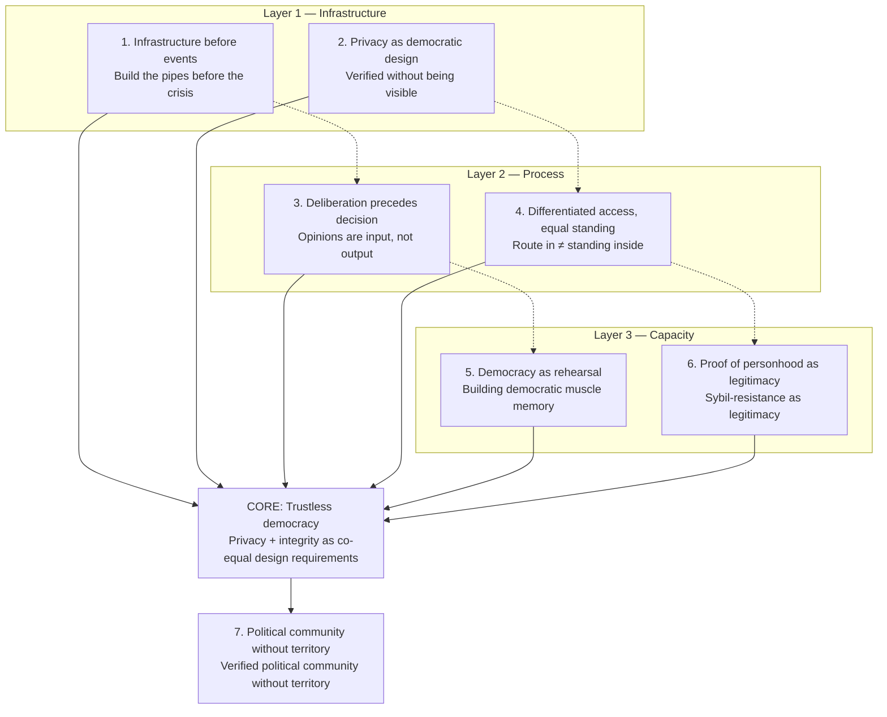

## Theory Map

The diagram below shows how the seven theories relate to one another. Theories 1–2 operate at the infrastructure layer, Theories 3–4 at the process layer, Theories 5–6 at the capacity layer, and Theory 7 is the emergent political outcome they collectively make possible.

---

## 1. Infrastructure Before Events

Most political thinking focuses on *moments* — elections, revolutions, constitutions. Digital democratic infrastructure operates from a fundamentally different premise: that **democracy is an infrastructure problem before it is a political problem**.

The narrative goes like this: Democracies don't fail because people stop wanting freedom. They fail because when the moment of change arrives, society lacks the *plumbing* — the trusted mechanisms for coordination, verified participation, structured deliberation, and institutional emergence. What this kind of infrastructure builds is that plumbing, before the moment arrives. This reframes the project from "political opposition" into something closer to **pre-transition democratic engineering** — building the pipes, valves, and measurement instruments of collective self-governance, not waiting for the crisis to improvise them.

This connects to a broader theoretical tradition: scholars like Larry Diamond on "democratic recession" point to the absence of civil-society infrastructure (not just authoritarian repression) as a root cause of failure; Daron Acemoglu and James Robinson's work on inclusive institutions shows that institutions must be *constructed*, not just declared. A trustless digital democracy platform is the first attempt to make this construction *digital, verifiable, and available under repression*.

---

## 2. Privacy as Democratic Design

Conventional thinking treats privacy and democratic accountability as a trade-off: the more anonymous participation is, the less accountable it becomes. The deepest theoretical contribution of cryptographic democracy is dissolving this tension entirely.

The narrative: **You can be verified without being visible. You can be unique without being known.** Zero-Knowledge Proofs (ZKPs) make it possible to prove membership in a political community — national, unique human, living person — without revealing which member you are. This is not just a cryptographic trick; it is a philosophical position about the nature of political trust.

Classical liberalism assumed that democratic participation required the risk of exposure: you sign the petition, you show up at the poll, your name is in the register. This new design says: *that assumption was contingent, not necessary*. It was contingent on the limits of pre-digital verification. ZKPs remove that limit. The result is a new model: **trustless democracy**, where the system's integrity derives from mathematics rather than from the goodwill of authorities or the courage of individuals.

This is a genuinely novel theoretical position worth naming explicitly.

---

## 3. Deliberation Precedes Decision

One of the most common failures of digital "democracy" tools is that they reduce participation to opinion-polling — they ask what people think, aggregate it, and call that democracy. A principled digital democracy platform is built on a fundamentally different theory: **opinions are not the output of democracy; they are the input to deliberation, which is the actual substance of democracy**.

This draws on deliberative democracy theory — Jürgen Habermas's communicative rationality, Amy Gutmann and Dennis Thompson's deliberative democracy, and the empirical work of deliberative mini-publics. The insight is that when people reason *together* — structured, facilitated, across perspectives — they change their minds, surface common ground, and produce better collective judgments than any aggregation of pre-formed opinions.

The subsidiarity principle extends this further: issues are deliberated in the *smallest relevant community first* before escalating. This prevents the homogenization that happens when diverse local contexts get flattened into a single national vote. The sequence — deliberate locally, surface agreement, escalate selectively — is a theory of how legitimate collective decisions actually form.

---

## 4. Differentiated Access, Equal Standing

A well-designed digital democracy platform makes a distinction that most democratic systems paper over: **the route into the democratic field does not determine your standing within it**. Different people arrive through different networks, trust pathways, and onboarding channels — including decentralized civic networks that specialize in reaching marginalized and underrepresented communities. Once inside, all participants are cryptographically equal. Their Digital Identifier (DID) carries no trace of how they arrived.

This is a subtle but powerful theoretical move. Most real-world democratic systems pretend to equalize standing while actually encoding the privileges of entry — who has a party affiliation, who has an existing network, who has visibility. A trustless platform separates these two problems architecturally. The inclusion challenge (widening *who enters*) is handled by civic networks and outreach partners. The equality challenge (ensuring equal standing *after entry*) is handled by the cryptographic infrastructure itself.

The theoretical framing here is close to John Rawls's "veil of ignorance" — but made operational rather than hypothetical. The system genuinely cannot distinguish a prominent diaspora politician from a teacher in a provincial town once both have verified their identity and entered the field.

---

## 5. Democracy as Rehearsal

One of the most powerful stories digital democratic infrastructure can tell is about *practice*. Authoritarian societies do not just suppress political rights — they *atrophy* democratic capacity. People forget how to deliberate, how to disagree productively, how to form coalitions, how to evaluate governance options. This is not a trivial problem: democratic transitions often fail not because of bad intentions but because of missing *democratic muscle memory*.

A trustless digital democracy platform is, among other things, a **rehearsal space for democracy**. Every vote taken, every deliberation structured, every position articulated and refined is practice for the real thing. The platform is not waiting for a transition to become relevant — it is building the habits, norms, and competencies that a democratic transition would require.

This is where civil society's educational role becomes indispensable: the platform and organized civil society together form a system for growing democratic capacity under conditions where it cannot yet be exercised in public life. The historical analogy is the role of underground samizdat culture in Soviet bloc countries, or the role of labor unions in early labor movements — spaces where organizational capacity and democratic habits were built in the shadow of systems that denied them formal expression.

---

## 6. Proof of Personhood as Legitimacy

Most political theory grounds legitimacy in consent. But consent requires knowing *who* consented and that they consented *once*. In digital environments, both of these are fragile: accounts can be faked, votes can be bought, bots can flood opinion spaces. The result is a crisis of legitimacy for digital democracy tools.

The contribution of cryptographic civic infrastructure is what might be called **proof-of-personhood as the foundation of political legitimacy**. The claim is that before we can ask *what* people think, we must establish *that* a person — unique, human, real — is doing the thinking. ZKPs combined with machine-learning liveness checks solve this problem at the level of mathematics, not institutional trust.

This connects to an emerging field of thought around proof-of-personhood systems, but a document-grounded approach takes this further by anchoring personhood in *state-issued identity documents* rather than biometrics alone or blockchain reputation. The theory is: legitimate political participation requires a trustless proof that the participant is a unique human being, and this proof can now be generated without revealing who that human being is.

---

## 7. Political Community Without Territory

This is perhaps the most evocative narrative, and the one with the most political resonance. Trustless digital democracy infrastructure makes possible something that has no precise historical precedent: a **verified, deliberating, decision-capable political community that exists independently of territory**.

Estonia's e-government showed that state services can be digital. This goes further — it shows that *political community itself* can be digital: that the demos (the people who constitute a political body) can be assembled, verified, deliberated with, and heard, independent of geographic location. For a diaspora of millions and a population living under surveillance, this is not a consolation prize. It is a genuine alternative architecture for political community.

The narrative: *A dispersed people is not simply scattered. For the first time in history, it is possible for them to constitute themselves as a verified, deliberating political body — inside their home country and across the diaspora simultaneously — without any government's permission and without exposing themselves to that government's surveillance.*

---
